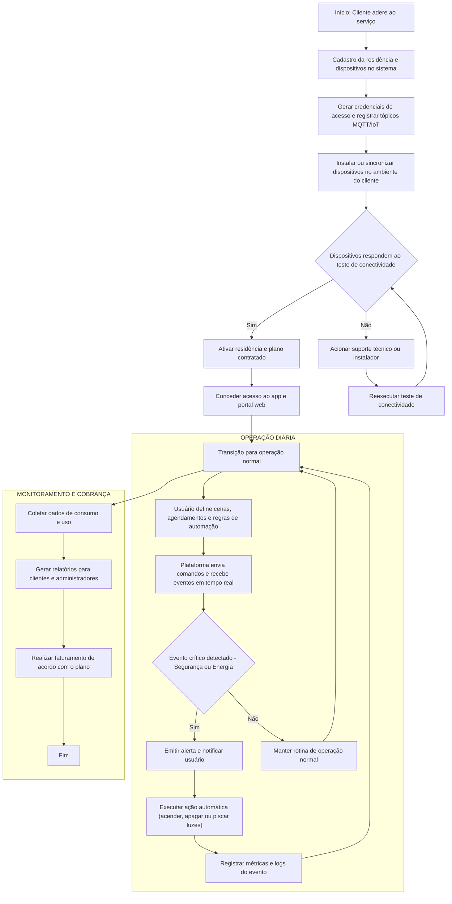

# Autoestudo 1 — Engenharia de Requisitos

**Aluno:** Kauan Massuia  
**Projeto:** Plataforma SaaS para coordenação de iluminação automatizada em 10.000 casas

---

## 1. Visão Geral do Problema
O projeto consiste em expandir um sistema de automação residencial de iluminação para uma **plataforma digital** capaz de gerenciar **10.000 residências**.  
A plataforma deve ser multi-tenant, escalável, segura e oferecer operação em tempo real, com interface web e mobile, além de APIs para integração.

Objetivos:
- Orquestrar rotinas de iluminação (agendamentos, cenas, gatilhos por sensores).
- Garantir escalabilidade, segurança, disponibilidade e observabilidade.
- Disponibilizar APIs e dashboard para usuários e administradores.

---

## 2. Stakeholders
- **Fornecedor SaaS** — define SLAs, cobrança e manutenção.
- **Administrador** — configura regras globais e monitora.
- **Usuário residencial** — agenda cenas, controla dispositivos e recebe alertas.
- **Dispositivos IoT** — sensores e controladores de iluminação.
- **Serviços externos** — autenticação, faturamento, notificações.

---

## 3. Visão 1 — Business Drivers (BPMN em Mermaid)

## 4. Visões 2 & 3 — Requisitos Funcionais e Não-Funcionais

### 4.1 Requisitos Funcionais (RF)
- **RF-01:** Permitir cadastro e provisionamento de novo tenant/residência.  
- **RF-02:** Emparelhar e registrar dispositivos IoT por residência.  
- **RF-03:** Criar, editar e excluir cenas (grupos de ações).  
- **RF-04:** Agendar rotinas e criar regras baseadas em tempo e eventos de sensores.  
- **RF-05:** Executar rotinas localmente via controlador edge quando offline.  
- **RF-06:** Expor API RESTful e endpoint em tempo real (WebSocket / MQTT).  
- **RF-07:** Expor painel de monitoramento e métricas por tenant.  
- **RF-08:** Permitir controle manual remoto (on/off, dim, cor).  

### 4.2 Requisitos Não-Funcionais (RNF)
- **RNF-01 (Escalabilidade):** Suportar 10.000 residências com pico previsível de eventos.  
- **RNF-02 (Disponibilidade):** SLA alvo 99.95% para APIs críticas.  
- **RNF-03 (Segurança):** Isolamento multi-tenant, OAuth2/OIDC, TLS, segredos em vault.  
- **RNF-04 (Latência):** Latência de comando ≤ 500 ms via cloud; ≤ 100 ms via edge local.  
- **RNF-05 (Resiliência):** Operação degradada local em perda de conectividade.  
- **RNF-06 (Observability):** Logging centralizado, métricas e tracing distribuído.  
- **RNF-07 (Manutenibilidade):** Pipelines CI/CD, testes automatizados, deployes canary/blue-green.  

## 5. Modelagem UML (PlantUML)

Abaixo estão todos os diagramas UML em código **PlantUML**.  
Cole cada bloco em um renderizador PlantUML (CLI, extensão do VSCode ou site) ou salve como `.puml`.

### 5.1 Diagrama de Atividades (Onboarding e Orquestração)
Este diagrama mostra o fluxo de atividades desde a adesão do cliente até a operação e monitoramento contínuos da plataforma.
Ele aborda três blocos principais: onboarding (cadastro e ativação de residência e dispositivos), operação diária (execução de cenas, agendamentos e resposta a eventos críticos) e monitoramento/cobrança (coleta de dados, relatórios e faturamento).

### 5.2 Diagrama de Casos de Uso
Mostra as interações dos diferentes atores com o sistema: usuário residencial, administrador e serviços externos.
Cada elipse representa uma funcionalidade do ponto de vista de quem utiliza, como criar cenas, monitorar métricas ou integrar autenticação.

### 5.3 Diagrama de Classes — Modelo Estático Avançado
Representa a estrutura lógica e as relações entre entidades centrais, como Tenant, Device, Scene e Schedule.
Inclui atributos, métodos e cardinalidades, ajudando no desenho do modelo de domínio e no alinhamento com o banco de dados.

### 5.4 Diagrama de Sequência — Execução de Cena Detalhado
Mostra a sequência temporal de mensagens quando uma cena é executada.
Desde o disparo do comando (usuário ou sistema) até o envio para dispositivos via MQTT e o registro de logs e métricas, evidenciando a ordem e o papel de cada ator.

### 5.5 Diagrama de Componentes — Arquitetura Microservices Profissional
Mapeia os serviços, módulos e infraestruturas da solução, incluindo APIs, serviços de cenas e agendamentos, broker MQTT, banco de dados e ferramentas de observabilidade.
As conexões indicam dependências e fluxos de dados, útil para implementação e deploy em Kubernetes.

### 5.6 Diagrama de Deployment — Infraestrutura Realista
Mostra a distribuição física dos componentes: microservices e bancos na nuvem, controlador edge na residência, e as conexões seguras entre eles.
Evidencia onde cada parte roda, fator crucial para latência, segurança e escalabilidade.

## 6. Visão 4 — Decisões de Engenharia
Principais decisões para cumprir os RNF:
- Arquitetura baseada em microservices (Kubernetes) para permitir escala horizontal.  
- Broker MQTT para telemetria e comandos; WebSocket para dashboards em tempo real.  
- EdgeController local para execução de regras críticas quando offline.  
- Isolamento lógico por tenantId (sharding/partitioning conforme necessidade).  
- Autenticação via OAuth2/OIDC; mTLS e segredos em vault.  
- Observability com OpenTelemetry, Prometheus e Grafana; logs em ELK/EFK.  
- CI/CD com pipelines e deploys canary / blue-green.  

## 7. Visão 5 — Plataformas, Ferramentas e Linguagens
- **Linguagens:** Node.js/TypeScript, Java/Kotlin, Python para scripts.  
- **Orquestração:** Kubernetes (EKS/GKE/AKS).  
- **Mensageria:** MQTT (EMQX/RabbitMQ plugin) + Kafka para eventos analíticos.  
- **Banco de Dados:** PostgreSQL (schema per tenant ou sharding), Redis, InfluxDB (timeseries).  
- **Observability:** Prometheus, Grafana, OpenTelemetry, ELK.  
- **CI/CD / Infra:** GitHub Actions, Terraform, Vault.  

## 8. Matriz de Rastreabilidade (RTM)

| ID    | Requisito                  | Artefato            | Diagrama           | Teste               |
|-------|---------------------------|---------------------|--------------------|---------------------|
| RF-01 | Cadastro de tenant        | Onboarding flow     | Atividades         | Unit + e2e          |
| RF-02 | Emparelhamento             | Device Registry     | Classes, Sequência | Simulação pairing   |
| RF-03 | Cenas                      | Scenes model        | Classes            | Execução cena       |
| RF-04 | Agendamentos               | Scheduler           | Componentes        | Teste cron/trigger  |
| RF-06 | API realtime               | API Gateway/MQTT    | Componentes        | Load MQTT           |

## 9. Observações Finais
- O BPMN em Mermaid está compatível com o renderer do GitHub (textos entre aspas; decision nodes sem caracteres problemáticos).  
- Os diagramas UML estão prontos em PlantUML; se preferir, pode-se criar uma pasta `diagrams/` com arquivos `.puml` individuais e um **ZIP** para download.  
- Caso necessário, os textos podem ser adaptados para um formato mais formal, técnico ou traduzidos.  

